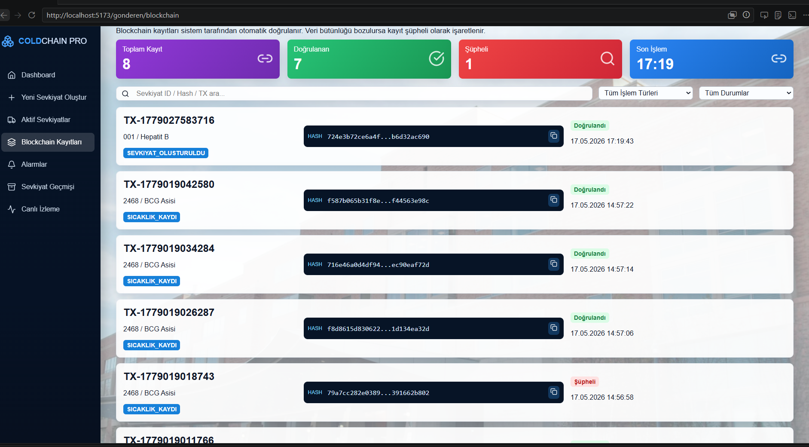
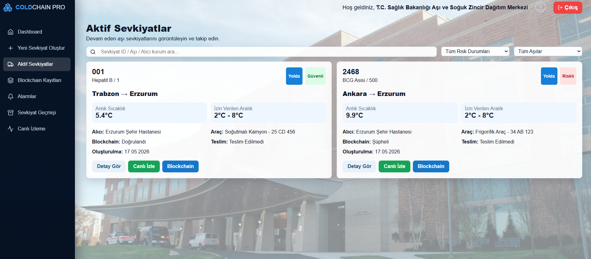
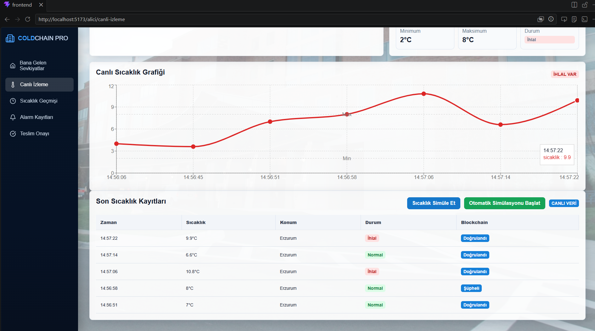
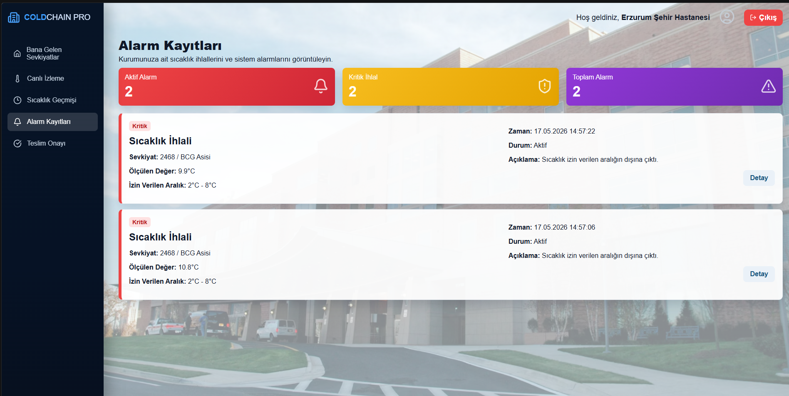

# Blockchain-Based Cold Chain Tracking System

A blockchain-supported cold chain tracking and monitoring system developed for vaccine shipment processes.

This project monitors vaccine shipments, tracks temperature violations, detects suspicious data changes, and verifies data integrity using SHA-256 hash verification.

---

# Features

- Sender and receiver institution roles
- Vaccine shipment creation
- Active shipment tracking
- Live temperature monitoring
- Temperature violation detection
- Alarm management
- Delivery confirmation
- Blockchain record tracking
- SHA-256 based data integrity verification
- Suspicious data detection after database changes

---

# Technologies

## Frontend
- React
- Vite
- React Router
- Recharts
- Lucide React
- CSS

## Backend
- Node.js
- Express.js
- MongoDB
- Mongoose

## Security / Blockchain Logic
- SHA-256 hash generation
- Blockchain record simulation
- Automatic integrity verification
- Suspicious record detection

---

# Screenshots

## Blockchain Records


## Active Shipments


## Live Monitoring


## Alarm Records


---

# Project Structure

```text
cold-chain-project
├── backend
├── frontend
├── screenshots
└── README.md